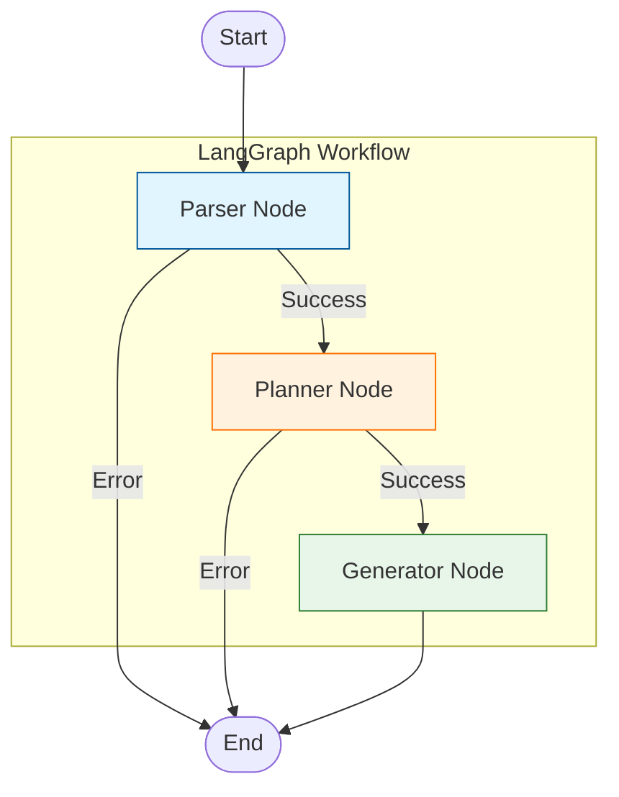

# Agent 架构与 LangGraph 实现详解

本文档详细介绍了 API 测试用例生成智能体的内部实现，重点阐述了如何使用 **LangGraph** 编排 AI 工作流。

## 1. 核心概念：状态图 (StateGraph)

本系统基于 `StateGraph` 构建。与传统的链式调用 (Chain) 不同，图 (Graph) 允许我们可以定义循环、条件分支和持久化状态。

### 1.1 状态定义 (AgentState)
系统的“大脑”是 `AgentState`，它是一个字典结构，在图的所有节点之间传递。

```python
class AgentState(TypedDict):
    openapi_spec_content: str  # 原始 OpenAPI 内容
    spec_summary: str          # 简化后的 API 描述 (用于 Prompt)
    user_preferences: Dict     # 用户配置 (语言, 模型 High/Low)
    test_plan: List[TestCase]  # 生成的测试计划列表
    generated_code_map: Dict   # 生成的代码结果
    error: str                 # 错误信息
```

## 2. 图结构 (Graph Archtecture)

我们的工作流由三个主要节点组成，呈线性流转，但在 `Generator` 阶段支持扩展为 Map-Reduce 模式。

### 2.1 节点 (Nodes)

1.  **Parser Node**:
    *   **输入**: `openapi_spec_content`
    *   **逻辑**: 使用 `ParserService` 解析 JSON/YAML，提取 endpoints 和 parameters。
    *   **输出**: 更新 `spec_summary`。

2.  **Planner Node**:
    *   **输入**: `spec_summary`, `user_preferences`
    *   **逻辑**: 根据 `PromptStrategyFactory` 获取对应的 Prompt (High Tier 使用 CoT, Low Tier 使用结构化输出)，调用 LLM 生成测试用例列表。
    *   **输出**: 更新 `test_plan`。

3.  **Generator Node**:
    *   **输入**: `test_plan` 中的单个 Case
    *   **逻辑**: 为特定测试用例生成代码。
    *   **输出**: 更新 `generated_code_map`。

### 2.2 工作流图示 (Mermaid)



## 3. 实现细节

### 3.1 提示词策略 (Prompt Strategy)
为了适配不同能力的模型，我们使用了策略模式工厂 `PromptFactory`。

*   **High Tier Strategy**: 
    使用复杂的 Prompt，要求模型进行 "Chain of Thought" (思维链) 推理。
    *例如*: "请先分析接口约束，再设计测试数据，最后编写代码。"
    
*   **Low Tier Strategy**:
    使用严格的 JSON 模版和 Few-Shot 示例，限制模型的自由度，防止幻觉。

### 3.2 节点间通信
LangGraph 自动处理节点间的状态传递。每个节点函数只需要返回**增量更新** (Partial Update)。

```python
# 示例：Planner Node 只返回 test_plan 更新
def planner_node(state: AgentState):
    # ... 逻辑 ...
    return {"test_plan": cases} 
    # LangGraph 会将这个 dict merge 到全局 State 中
```

## 4. 扩展性
当前实现为 V1 版本。基于 LangGraph，我们可以轻松扩展：
*   **Human-in-the-loop**: 在 Planner 和 Generator 之间增加一个人工审核节点。
*   **Self-Correction**: 如果 Generator 生成的代码运行报错，可以增加一个 "Reflector" 节点，将错误信息反馈给 LLM 进行重试 (循环边)。
